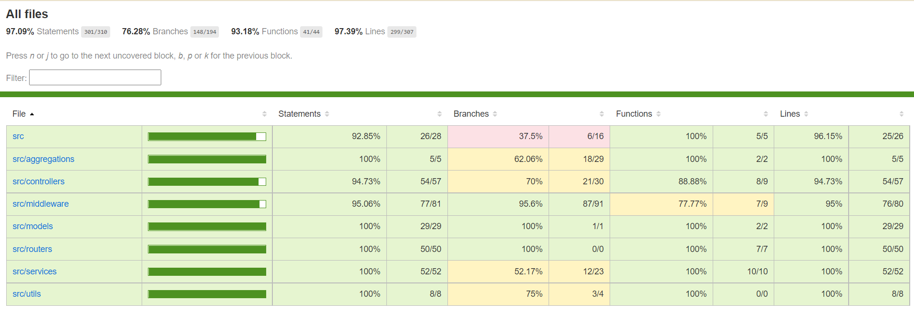

# dog-adopters 

### This Fullstack project embodies my extensive knowledge of backend and frontend development, as it has been executed with adherence to best practices, standards, and strict guidelines. <br />

### The frontend part is still under development and not finished yet!

---

The project stores data in a database and provides access through **REST APIs**, these APIs are developed using _NodeJS_, _typescript_, and _express ts_.

| For authentication and users        | For dogs data                                                  |
| ----------------------------------- | -------------------------------------------------------------- |
| + Register user                     | + Get dog by id                                                |
| + Login user                        | + Get dog list with filters and sorting options                |
| + Logout user                       | &emsp; - Authentication is required                            |
| + Get user by id                    | &emsp; - Pagination included in the response                   |
| &emsp; - Authentication is required | + Create new dog                                               |
|                                     | &emsp; - Authentication is required                            |
|                                     | &emsp; - Owner id is auto-assigned from the authenticated user |
|                                     | + Update exists dog data                                       |
|                                     | &emsp; - Authentication is required                            |
|                                     | &emsp; - Only owner/admin allowed to operate                   |
|                                     | + Delete exists dog                                            |
|                                     | &emsp; - Authentication is required                            |
|                                     | &emsp; - Only owner/admin allowed to operate                   |
|                                     | + upload dog profile image file                                |
|                                     | &emsp; - Authentication is required                            |
|                                     | &emsp; - Only owner/admin allowed to operate                   |
|                                     | + get available dog races in db for future filters             |
|                                     | &emsp; - Authentication is required                            |
|                                     | &emsp; - Only owner/admin allowed to operate                   |

### In addition, the project boasts extensive Swagger API documentation, covering all the REST APIs mentioned above, accessible at: <br /> `http://localhost:3000/swagger` <br />

**NOTE:**
Certain APIs necessitate authentication, requiring users to log in before executing them. These authenticated APIs are denoted by a lock symbol. <br />
 <br />

---

**Requirements**

- _NodeJS_ version 16.4+
- _MongoDB service_ version 6.0.1+

**Command lines**

- **The command to init and install project**
  - `npm install`
- **The command to run the project**
  - `npm run start`<br /> (executing migrations, building the TypeScript code, and running the compiled JavaScript project)
- Additional commands that are optional
  - `npm run migrationDB`
    <br />(runs only migration)
  - `npm run dev`<br /> (runs _typescript_ code for development with _nodemon_)
  - `npm run test`<br /> (runs only tests with _jest_ + _supertest_ for APIs tests)

---

### Test Coverage:

## 

### The technologies used in this project include:

- [x] _**Nodejs**_ : the project is _javascript_ based.
- [x] _**Express**_ : used for the server side routers, middlewares, controllers, and services.
- [x] _**Typescript**_ : the project has been implemented using _typescript_ interfaces, `<filenames>.d.ts` declarations files, etc..
- [x] _**DotEnv**_ : utilizes _dotenv_ files to manage environment variables, and incorporates _dotenv-expand_ to enhance flexibility in the env files.
- [x] _**logger**_ : utilizes colorized _**Winston**_ logs with request ID (UUID) for recording server activities stored in daily rotating files (`winston-daily-rotate-file`).
- [x] _**Passport**_ : authentication with _passport-local_ strategy `{username, password}` for request body.
- [x] _**MongoDB**_ : utilized with the _**mongoose**_ library for defining schemas and models, which are then utilized in the controllers and services.
- [x] _**Bcrypt**_ : user passwords are securely encrypted in accordance with best practices to ensure data security.
- [x] _**Swagger**_ : the `/swagger` URL provides comprehensive API documentation and instructions for testing and debugging APIs,this functionality is available in non-production environments (for development), the project also utilizes _**mongoose-to-swagger**_ to transform mongoose models into Swagger schema docs.
- [x] _**mongo-migrate**_ : the **migrations** ensure that the MongoDB database has the latest updates of the data before running the project, they also handle important database initializations, including users creation and mocked dogs data.
- [x] _**express-rate-limit**_ : to prevent cyber attacks like brute-force on the login API, user requests to specific APIs are restricted with a maximum number of attempts.
- [x] _**multer**_ : utilizes the _multer_ middleware API to enable file uploads, such as images, for the dog profile.

### Additional technologies used as development tools include:

- [x] _**nodemon**_ : watches for _typescript_ file changes and compiles them in real-time.
- [x] _**Jest**_ : Comprehensive _typescript_ tests with extensive coverage, including password encryption, models, services, and router APIs, have been implemented using the _supertest_ package.
- [x] _**mongodb-memory-server**_ : running tests on an in-memory database, allowing for efficient and isolated testing.

### In addition, the project incorporates the following features:

- [x] **aggregations** : a fully featured aggregate request filters dogs based on query parameters, populates the dog by its creator, and supports data limiting, offsetting, and sorting options.
- [ ] **transactions** : the project does not incorporates multiple operations for a single process action, despite being aware of the concept.
- [x] **server side pagination** : the project implements pagination for the aggregation result data, enabling fetching a limited number of items based on the provided page number and items per page parameters.<br />

```json
{
"pagination": {
    "totalItems": 487,
    "page": 5,
    "itemsPerPage": 20,
    "totalPages": 25
},
"data": [...]
}
```

- [x] **_passport_ authentication** : user authentication in the project follows best practices by comparing the encrypted password with the plaintext password provided.
- [x] **override toJSON data** : exclude the password from the user object when it is returned as JSON.
- [x] **_mongoose_ schema hooks** : incorporates a pre-save hook that encrypts the user's password before creating a new user.
- [x] **status code** : HTTP request responses return the appropriate and correct status codes.
- [x] **_jest_** : comprehensive tests for thorough validation of all services and functions.
- [x] **_postman_** : _postman_ collection for simplified testing and interaction with the project's APIs : </br>
      `dog_adopters_rest_api.postman_collection.json`

## Author

:octocat: **Afek Sakaju**

- LinkedIn: [@afeksa](https://www.linkedin.com/in/afeksa/)
- GitHub: [@afekTheMiniLearner](https://github.com/afekTheMiniLearner)
